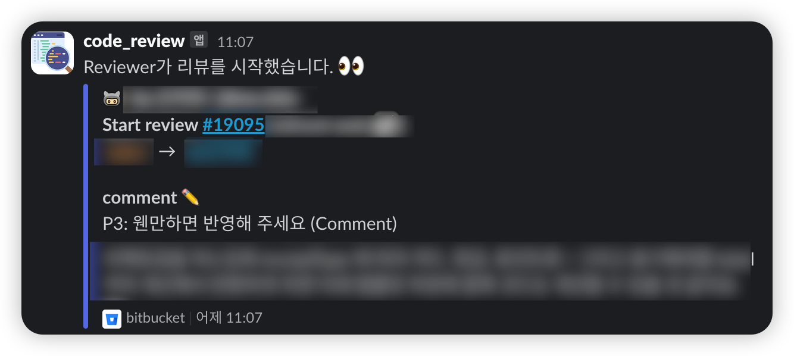
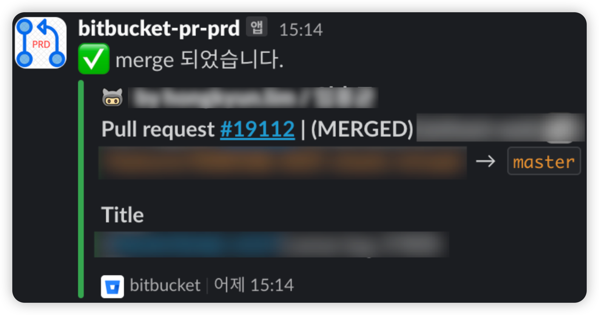
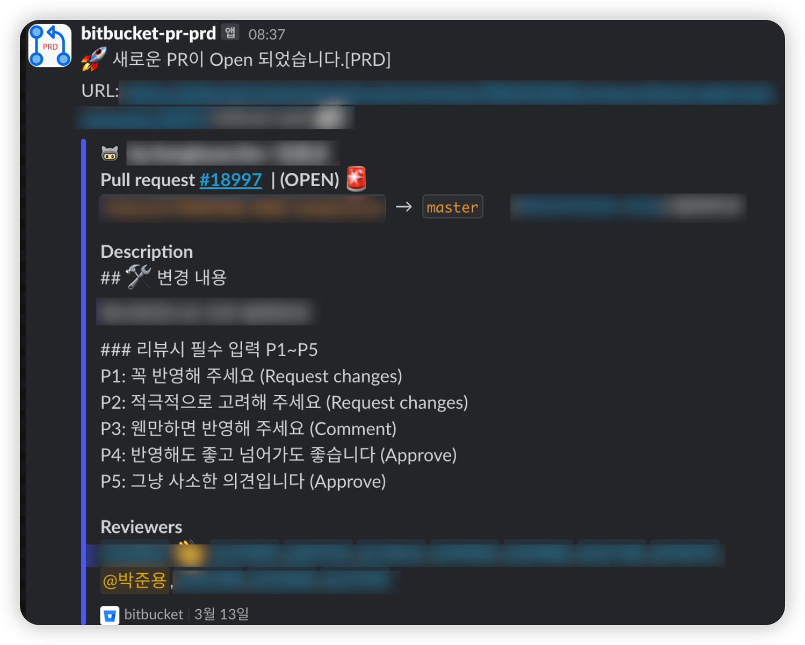

# Bitbucket Alert Bot

Bitbucket Webhook 이벤트를 감지하여 Slack 및 기타 메신저로 알림을 전송하는 Node.js 기반 Express 서버입니다.

## 기능

- Bitbucket Webhook 이벤트 수신 및 처리
- 다양한 이벤트 타입 지원 (Push, PR, Issue 등)
- Slack과 Discord 알림 지원

## 기술 스택

- Node.js
- TypeScript 5
- Express.js
- ESLint, Prettier

## 설치 및 실행

### 필수 조건

- Node.js 18 이상
- npm 또는 yarn

### 설치

```bash
# 저장소 클론
git clone https://github.com/yourusername/bitbucket-alert-bot.git
cd bitbucket-alert-bot

# 의존성 설치
npm install
```

### 환경 변수 설정

`.env.example` 파일을 참고하여 `.env` 파일을 생성하세요:

```bash
cp .env.example .env
```

`.env` 파일을 편집하여 필요한 설정을 입력하세요:

```env
PORT=3000
SLACK_WEBHOOK_URL=https://hooks.slack.com/services/YOUR_WEBHOOK_URL
```

## Project setup

```bash
$ pnpm install
```

## Compile and run the project

```bash
# development
$ pnpm run start

# watch mode
$ pnpm run start:dev

# production mode
$ pnpm run start:prod
```

## Run tests

```bash
# unit tests
$ pnpm run test

# e2e tests
$ pnpm run test:e2e

# test coverage
$ pnpm run test:cov
```

## Bitbucket Webhook 설정

이 프로젝트는 Bitbucket 웹훅을 처리하여 Slack으로 알림을 보내는 기능을 제공합니다.

### 환경 변수 설정

`.env` 파일을 생성하고 다음과 같이 설정합니다:

```
SLACK_WEBHOOK_URL=https://hooks.slack.com/services/YOUR_WEBHOOK_URL
```

### Bitbucket 웹훅 엔드포인트

다음 엔드포인트를 Bitbucket 웹훅 설정에 등록하세요:

- 범용 웹훅 (모든 이벤트): `POST /bitbucket-hook/webhook`
- PR 생성: `POST /bitbucket-hook/pr/created`
- PR 댓글: `POST /bitbucket-hook/pr/comment`
- PR 승인: `POST /bitbucket-hook/pr/approved`
- PR 병합: `POST /bitbucket-hook/pr/merged`
- PR 거부: `POST /bitbucket-hook/pr/declined`
- PR 삭제: `POST /bitbucket-hook/pr/deleted`

### Bitbucket 웹훅 설정 방법

1. Bitbucket 저장소에서 Settings > Webhooks로 이동
2. Add webhook 클릭
3. 다음 정보 입력:
   - Title: 원하는 제목 (예: Slack Notification)
   - URL: 서버 URL + 엔드포인트 (예: https://your-server.com/bitbucket-hook/webhook)
   - Status: Active
   - Events: 필요한 이벤트 선택 (Pull Request, PR Comment 등)
4. Save 클릭

## 메신저 연동

### Slack

1. Slack 워크스페이스에서 "incoming webhook" 앱을 추가
2. 웹훅 URL을 생성하고 `.env` 파일의 `SLACK_WEBHOOK_URL`에 추가

### Discord

1. Discord 서버 설정에서 "Integrations" 메뉴로 이동
2. "Webhooks" 항목에서 새 웹훅 생성
3. 웹훅 URL을 복사하여 `.env` 파일의 `DISCORD_WEBHOOK_URL`에 추가

## 라이센스

MIT

## 🔥 주요 기능

- Bitbucket PR 생성, 리뷰, 코멘트 등의 이벤트 감지
- 감지된 이벤트를 특정 메신저(Webhook URL)에 맞는 포맷으로 변환하여 전송
- 각 채팅방별로 다른 Webhook URL 설정 가능
- Express API를 통해 설정 및 이벤트 관리 가능
- 보안 설정 (API Key 또는 인증 방식 추가 예정)

## 지원 메신저

- Slack
- 기타 웹훅 지원 메신저

## 📦 설치 및 실행

```sh
git clone https://bitbucket.org/your-repo/bitbucket-alert-bot.git
cd bitbucket-alert-bot
npm install
```

## 알림 예시

Bitbucket Alert Bot이 전송하는 알림 메시지 예시는 다음과 같습니다.

### 1. 코드 리뷰 알림



- PR 생성 또는 리뷰 요청 시 전송되는 알림 예시입니다.
- PR 제목, 작성자, 리뷰어, 브랜치 정보 등이 포함됩니다.

### 2. PR 병합 알림



- PR이 성공적으로 병합되었을 때 전송되는 알림 예시입니다.
- 병합자, 병합된 브랜치, PR 정보가 포함됩니다.

### 3. PR 운영 배포 알림



- PR이 운영 환경에 배포되었을 때 전송되는 알림 예시입니다.
- 배포 브랜치, 배포자, 관련 PR 정보가 포함됩니다.
